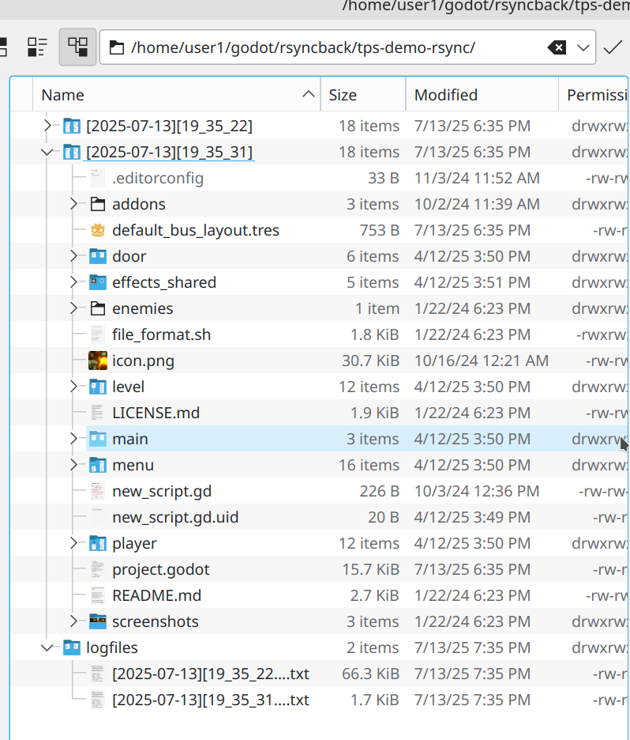

# RsyncBack Godot Plugin Documentation

# For Linux, MacOSX and Windows(*)

## <u>Quick Setup and Run RsyncBack</u>

RsyncBack is a plugin addon that allows you to create fast incremental date-stamped backups of your Godot project with a simple click of a button. For more detailed description see [What is rsync?](#what-is-rsync?)

The following is a quick setup and run.

1. Download and install the RsyncBack plugin from the Godot AssetLib of your project or clone directly from Github to the ../addons folder of your project.
2. Enable the RsyncBack plugin in Godot’s Project Settings > Plugins
3. To start a backup, click on the RsyncBack link at the top of the editor to see the main screen. Here you select the rsync executable path, the backup path as well as some other options. The first time, you see a screen similar to Fig 1

<b>Fig 1</b>

4. If rsync is installed and in the $PATH environment (usually /usr/local/bin/ or /usr/bin/), the Rsync Cmd Path label will show the path and version. If not you can manually choose it by clicking on Rsync Cmd Path (see the section below [Finding the rsync command](#finding-the-rsync-command)
5. Click on Backup Destination Path and pick a folder to use for backup. At this point you will see your screen changed similar to **Fig 2**. and the Run Rsync button enabled.

<b>Fig 2</b>

6. Click on the Exclude File and edit any patterns of files you want to exclude from backup. One line per pattern

- Example. to exclude .godot, or any .git folders or any files with an extension of .import.  
    .godot .git*  
    *.import  
    

7. To start the backup, click on the Run Rsync button and a popup report will show your project files backed up. The first backup is the longest as the complete project folder is backed up. See example **Fig 3**.

<b>Fig 3</b>

8. Click on View Backup Destination Path to review your backup and the log file. You should see the backup folders similar to Fig 4

9. 

<b>Fig 4</b>

10. Go back to editing your project (e.g. clicking on Script). When ready to backup again click on RsyncBack link to open the plugin screen and then click the Run Rsync button.  A new report will show only the files that were backed up.

## What is rsync?

Rsync is one of the most popular and stable open source backup tools included with Linux and MacOSX. It is a terminal run tool with numerous options and arguments for backing up your computer folders incremental/differential, It has been battle tested for years now, is very reliable and has great community support. In its basic form it is a copy/sync tool, in that it copies files from source folder to a destination folder. Rsync backs up files using the native file system of your computer. It does not have its own compressed or proprietary database. You can easily use your File Manager to restore with drag and drop any backup folder or individual files. You can of course view them as regular files using your favorite File Manager. For Linux it could be Dolphin/Nemo/etc and Mac it could be Finder. Or it could be the command line using ls.

## What is the purpose of the RsyncBack plugin.

The main usage for RsyncBack plugin is to be a Godot GUI front end and to make it simple to quickly setup and incrementally backup your project. Once installed and configured, the plugin can be run with just the press of a button to make date-stamped incremental backups of your project source files. Each date-stamped backup is its own folder, having the name `[YYYY-MM-DD][HH-MM-SS]`. In addition, it saves storage, because the destination will not contain files that have not been modified but rather a hardlink to the last one modified. When you look or use any of the backup folders, it will look like a complete backup of your source. More on this later.

## Finding the rsync command

Before you begin, check that rsync is installed on your system. You can easily check from the command line by running the following terminal commands:  $ which rsync to show you the default path or $ whereis rsync to check if there are more than one installed. RsyncBack requires version 3.2.4 or above. See Fig A1. To choose the desired rsync path, click on the label Rsync Cmd Path

~$ which rsync

/usr/local/bin/rsync

~$ rsync -V

rsync  version 3.2.7  protocol version 31

Copyright (C) 1996-2022 by Andrew Tridgell, Wayne Davison, and others.

.......

~$ whereis rsync

rsync: /usr/bin/rsync /usr/local/bin/rsync /usr/share/rsync /usr/share/man/man1/rsync.1.gz

Fig A1

## **For Windows Users: Installing and running the rsync command.

The RsyncBack addon is installed as usual. However you need to tell it where the rsync.exe command is located. To do that you would need to install MSYS2 which is a list of Linux commands that run as native to Windows. An open source consortium called MSYS2 created popular Linux commands that run natively on Windows. There is no need to install Linux to do that!

From their documentation page at [https://www.msys2.org](https://www.google.com/url?q=https://www.msys2.org&sa=D&source=editors&ust=1752710978297009&usg=AOvVaw2IBV09jFifKjKXb5G7c51c)/:

- MSYS2 is a collection of tools and libraries providing you with an easy-to-use environment for building, installing and running native Windows software.

Additional docs here: [https://www.msys2.org/docs/what-is-msys2/](https://www.google.com/url?q=https://www.msys2.org/docs/what-is-msys2/&sa=D&source=editors&ust=1752710978297700&usg=AOvVaw165IvSn3UOk0Q4QzYSHp4r)

On your Windows box, follow this link [https://www.msys2.org/#installation:](https://www.google.com/url?q=https://www.msys2.org/%23installation&sa=D&source=editors&ust=1752710978298153&usg=AOvVaw2ylkCiPCa0C4eZjIyvGIDy) and the instructions to install the msys2 executable.

This will create a native windows folder followed by the path to Linux exe  commands.

You can then install rsync from the terminal that opens up as follows:

rsync.exe can be installed via

pacman -S rsync

It then runs natively under Windows as

c:/msys64/usr/bin/rsync.exe

So in this case, you would choose the path above the RsyncBack screen as the path for rsync.

Note: There are a few articles online on how to install MSYS2 and rsync.

In fact here is one explaining how to do it if you are using Git. [https://tlundberg.com/installing-rsync-on-windows](https://www.google.com/url?q=https://tlundberg.com/installing-rsync-on-windows&sa=D&source=editors&ust=1752710978300371&usg=AOvVaw24eApOnMICqLL6VHAzBxVx)

From the article: If you didn't already know, Git for Windows and its Git Bash environment is built using [msys2](https://www.google.com/url?q=http://msys2.org/&sa=D&source=editors&ust=1752710978300813&usg=AOvVaw335tSAbpp4EALksPZui4UQ), but it doesn't include all the binaries from that project.

## Backup Folders Layout and Restore

As we said before, RsyncBack creates an rsync command that incrementally backs up your project to your chosen backup folder. The backup folder will always be called <project name folder>-rsync. Inside this folder the backups are copied with the name [YYYY-MM-DD][HH_MM_SS]. Also the backup folder includes another folder called logfiles, where each backup’s report is kept. See Fig A4

The backup folders are exact ordinary folders of your project. To restore, you can copy or view using your system's File Manager.

Fig A4.

Even though it may look to you that in your latest folder the complete project was copied, in fact what you are seeing is an image copy of the previous backup overwritten by the files that are different. This is the power of Linux/Mac file system and it is all done in the background using hardlinks. It allows for efficient disk storage and speed. Rsync does that by comparing your source folder (ie your project folder) with the latest backup then copies the changed files to the destination. The unchanged are hardlinked. The option that does this is --link-dest=”your/last/backup/folder”  See example command below.

In fact every file you create is a hardlink to an inode. If you copy that file to another folder it does not duplicate it. It simply makes a directory entry pointing to what is called an inode. Inodes are beyond the scope of this document, but if you are curious about inodes read the short tutorial [rsync incremental and hard links backup concepts](https://www.google.com/url?q=https://digitalis.io/blog/linux/incremental-backups-with-rsync-and-hard-links/&sa=D&source=editors&ust=1752710978305280&usg=AOvVaw2dmUIpbxQKSH21u2SwlNOw)

## Customizing the Defaults of RsynBack.

A new install of RsyncBack initially reads the choices from a resource file called config.tres. The user then makes the selections and runs the backup. This config.tres can be manually edited in the Inspector. The simplest way to do that is to click on the Config File label link and select Edit In Inspector (Make sure Inspector is showing in the dock). The Godot Inspector will load the config.tres resource file and allow you to make the changes manually and save the config file. Make sure you reload the plugin.

Hover over each of the config.tres properties and read the tooltip for more info. The Rsync Arguments Template is where you would customize further the rsync command options.

It looks similar to this:

{dry_run_argument} -avih --mkpath --stats  \

 --out-format="%M %15'l %5f"  \

 --exclude-from="{exclude_file_path}" \

 --link-dest="{dest_path}/{project_name}/{prev_backup}" \

 --log-file-format="%M %15'l %5f" \

 --log-file="{log_file_path}/{current_datetime}{log_file_suffix}" \

 "{source_path}" \

 "{dest_path}/{project_name}/{current_datetime}"

The curlies {} are properties replaced by RsyncBack when you run the project. In effect the above becomes something like this command which is what executes.

/usr/local/bin/rsync  -avih --mkpath --stats  \

 --out-format="%M %15'l %5f"  \

 --exclude-from="/home/user1/godot/tps-demo/addons/rsyncback/exclude.txt" \

 --link-dest="/home/user1/myback/tps-demo-rsync/[2024-10-16][13_22_37]" \

 --log-file-format="%M %15'l %5f" \

 --log-file="/home/user1/myback/tps-demo-rsync/logfiles/[2024-10-18][17_07_35]_log.txt" \

 "/home/user1/godot/tps-demo/" \

 "/home/user1/myback/tps-demo-rsync/[2024-10-18][17_07_35]"

In fact you will see this command in the Rsync Command window. You can click and copy it to the clipboard and run it directly in the command line if you wish!

Notice the rsync command is added from the path you chose. Also {dry_run_argument} 

Is not used in this case since we didn’t check the box. Dry run does not make a backup but simply executes to see if your command is ok. It is always reset back.

You can modify this template anyway you want. E.g. add a remote backup ssh keyfile or add –delete option. Study up on rsync if you plan to customize the template.

## References:

|   |   |
|---|---|
|Official Website|[https://rsync.samba.org](https://www.google.com/url?q=https://rsync.samba.org&sa=D&source=editors&ust=1752710978312072&usg=AOvVaw25CHlN9F1bTtMpuzVnW1u7)|
|rsync man page|[https://ss64.com/bash/rsync.html](https://www.google.com/url?q=https://ss64.com/bash/rsync.html&sa=D&source=editors&ust=1752710978312695&usg=AOvVaw2iYK5ejJnbxcPtT15k0n-v)|
|Command line tutorial/Examples|[https://www.geeksforgeeks.org/rsync-command-in-linux-with-examples/](https://www.google.com/url?q=https://www.geeksforgeeks.org/rsync-command-in-linux-with-examples/&sa=D&source=editors&ust=1752710978313395&usg=AOvVaw2jHyTD_11nu4whroMVjCb7)|
|rsync incremental and hard links backup concepts|[https://digitalis.io/blog/linux/incremental-backups-with-rsync-and-hard-links/](https://www.google.com/url?q=https://digitalis.io/blog/linux/incremental-backups-with-rsync-and-hard-links/&sa=D&source=editors&ust=1752710978314098&usg=AOvVaw07zz477f_5QuOstVr4SzCb)|
|Installing rsync for Windows.|[https://www.msys2.org/](https://www.google.com/url?q=https://www.msys2.org/&sa=D&source=editors&ust=1752710978314618&usg=AOvVaw0Mjlx0uL2EENfNgSCe6qRc)|

Page